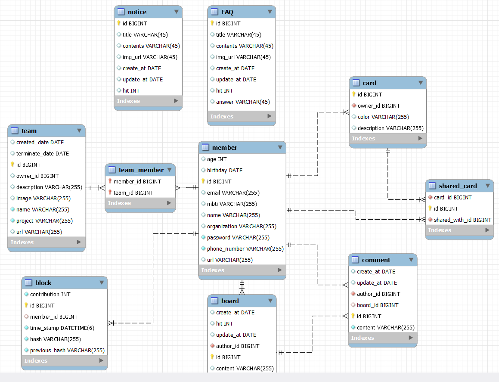

# 가장 신뢰성 높은 공유명함 서비스 'IntroMe'

## 🚀 소개
IntroMe는 블록체인 기술을 이용하여 신뢰성 높은 프로필을 실시간으로 공유할 수 있는 플랫폼입니다.    
사용자는 자신의 이력과 프로필을 안전하게 관리하고, 필요할 때마다 이를 효율적으로 공유할 수 있습니다.

## App Preview

## 🙍‍♂️Contributor
|||||
|:----:|:----:|:----:|:----:|
| (팀장)[백은호](https://github.com/BackEunHo) | [이인호](https://github.com/2inlee) | [이승규](https://github.com/vlqhel3440) | [이정욱](https://github.com/kakao3450) |
| Front-End | Back-End | Back-End | Front-End |

## ✨ 주요 기능
- **프로필 생성 및 공유**: 사용자는 자신의 이력서를 프로필로 생성하고, 이를 QR코드, PDF 또는 카카오톡을 통해 쉽게 공유할 수 있습니다.
- **블록체인 기술 활용**: 모든 프로필 정보는 블록체인에 안전하게 저장되며, 이를 통해 정보의 신뢰성과 안정성을 보장받을 수 있습니다.
- **팀 이력 관리**: 프로젝트가 종료되면, 팀원들은 각자의 역할과 기여도를 블록체인에 기록하여 공유할 수 있습니다.
- **오픈 스페이스**: 프로젝트가 끝나고 기록되지 않고 버려진 프로젝트가 있으신가요? 이를 공유하고 기록해보세요.

## 📘 사용 방법
1. 앱을 다운로드하고 설치합니다.
2. 개인 프로필을 생성하고, 필요한 정보를 입력합니다.
3. 프로필을 QR코드, PDF 또는 카카오톡으로 공유합니다.

## 📱 프로필 공유
- **QR 코드**: 모바일 디바이스를 통해 쉽게 스캔하고 접근할 수 있습니다.
- **PDF 내보내기**: 전문적인 형태의 명함으로 저장하고 인쇄할 수 있습니다.
- **카카오톡 공유**: 친구나 동료에게 채팅을 통해 직접 공유합니다.

## Tech
- Backend :    

- Frontend : 

## Backend ERD

## IntroMe_Preview

## 🤝 기여하기
이 프로젝트는 오픈 소스이며, 다양한 기여를 환영합니다. 기능 개선, 버그 수정, 문서 업데이트 등 여러 방법으로 기여할 수 있습니다.

## 📞 연락처
더 많은 정보를 원하시거나 도움이 필요하시면 [여기](mailto:admin@introme.co.kr)로 연락주세요.

---
IntroMe는 모두의 프로필을 안전하고 신뢰성 있게 관리하는 데 도움을 주기 위해 노력합니다. 여러분의 참여와 피드백을 기다립니다!
